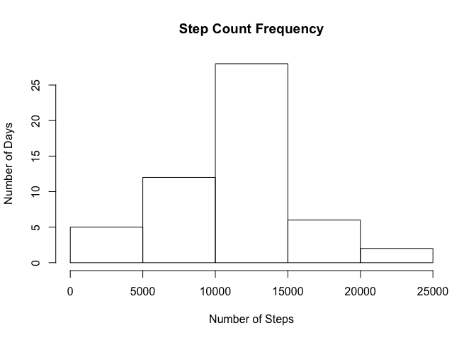
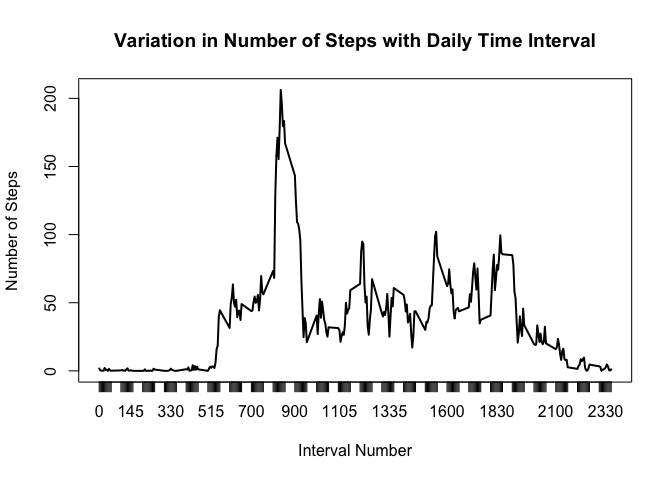
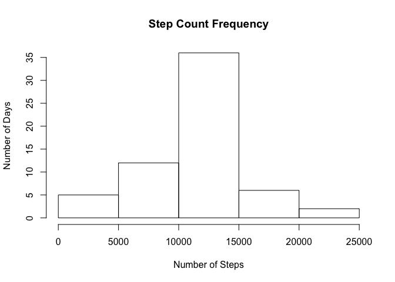
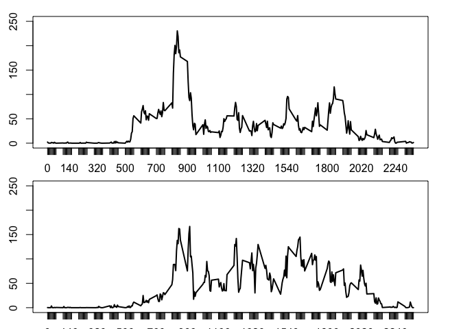

# PA1_template.rmd
FC Baker  
October 18, 2017  


## R Markdown

This is an R Markdown document. Markdown is a simple formatting syntax for authoring HTML, PDF, and MS Word documents. For more details on using R Markdown see <http://rmarkdown.rstudio.com>.

When you click the **Knit** button a document will be generated that includes both content as well as the output of any embedded R code chunks within the document. You can embed an R code chunk like this:

##1. Load and Preprocess the Data

```r
rawfile <- read.csv("activity.csv")
##convert date from factor to date
rawfile$date <- as.Date(rawfile$date, format = "%Y-%m-%d")
```

##2.What is the mean total number of steps each day?
For this part of the assignment, you can ignore the missing values in the dataset.
Make a histogram of the total number of steps taken each day
Calculate and report the mean and median total number of steps taken per da

```r
dayfile <- by(rawfile$steps, rawfile$date, sum, simplify = TRUE)
hist(dayfile, xlab = "Number of Steps", ylab = "Number of Days", main = "Step Count Frequency")
```

<!-- -->

```r
## Mean and Median Number of Steps by Day Computed in Summary
summary(dayfile)
```

```
##    Min. 1st Qu.  Median    Mean 3rd Qu.    Max.    NA's 
##      41    8841   10765   10766   13294   21194       8
```
As seen in the summary output above, the mean number of steps (10,765) and the median number of steps (10,766) are similar.

##3. What is the Average Daily Activity Pattern?

Make a time series plot (i.e. type = "l") of the 5-minute interval (x-axis) and
the average number of steps taken, averaged across all days (y-axis)
Which 5-minute interval, on average across all the days in the dataset, contains the maximum number of steps?

```r
## Compute average number of steps in each 5 minute interval
intfile <- by(rawfile$steps, rawfile$interval, mean, na.rm = TRUE)
plot(as.table(intfile), type = "l", ylab = "Number of Steps", xlab = "Interval Number", main = "Variation in Number of Steps with Daily Time Interval")
```

<!-- -->

```r
## Calculate the maximum step interval
max <- which.max(intfile)
maxval <- max(intfile)
max
```

```
## 835 
## 104
```

```r
maxval
```

```
## [1] 206.1698
```
As seen from the output above the max value is 206.158, and it occurred in the 104th interval(835 minutes into the day)

##Imputing missing values

Note that there are a number of days/intervals where there are missing values (coded as NA). The presence of missing days may introduce bias into some calculations or summaries of the data.

Calculate and report the total number of missing values in the dataset (i.e. the total number of rows with NAs)

Devise a strategy for filling in all of the missing values in the dataset. The strategy does not need to be sophisticated. For example, you could use the mean/median for that day, or the mean for that 5-minute interval, etc.

Create a new dataset that is equal to the original dataset but with the missing data filled in.

Make a histogram of the total number of steps taken each day and Calculate and report the mean and median total number of steps taken per day. Do these values differ from the estimates from the first part of the assignment? What is the impact of imputing missing data on the estimates of the total daily number of steps?


```r
##Calculate total number of rows with NAs
nrows <- sum(!complete.cases(rawfile))
nrows
```

```
## [1] 2304
```
The calculation above shows that 2304 of the rows in the data set contain NAs

To impute step values for NAs, use the average of that interval value

```r
##Create a logical vector with locations of step NAs
loc <- is.na(rawfile$steps)
##Replace these locations with value from average vector (intfile)
rawfile$steps[loc] <- intfile
```
Calculate the total mean and median  total number of steps per day as before

```r
dayfile2 <- by(rawfile$steps, rawfile$date, sum, simplify = TRUE)
hist(dayfile2, xlab = "Number of Steps", ylab = "Number of Days", main = "Step Count Frequency")
```

<!-- -->

```r
## Mean and Median Number of Steps by Day Computed in Summary
summary(dayfile2)
```

```
##    Min. 1st Qu.  Median    Mean 3rd Qu.    Max. 
##      41    9819   10766   10766   12811   21194
```
Mean and median had negligible changes after NAs were replaced. This likely means that the NAs were randomly distributed. The net change in step counts (as seen in the revised histogram) shows that the quintiles shifted toward the mean, meaning a greater number of days with higher counts. 

##Are there differences in activity patterns between weekdays and weekends?

For this part the weekdays() function may be of some help here. Use the dataset with the filled-in missing values for this part.

Create a new factor variable in the dataset with two levels -- "weekday" and "weekend" indicating whether a given date is a weekday or weekend day.

Make a panel plot containing a time series plot (i.e. type = "l") of the 5-minute interval (x-axis) and the average number of steps taken, averaged across all weekday days or weekend days (y-axis).

Create a new factor variable for weekend vs weekday

```r
library(dplyr)
```

```
## Warning: package 'dplyr' was built under R version 3.4.2
```

```
## 
## Attaching package: 'dplyr'
```

```
## The following objects are masked from 'package:stats':
## 
##     filter, lag
```

```
## The following objects are masked from 'package:base':
## 
##     intersect, setdiff, setequal, union
```

```r
library(lubridate)
```

```
## 
## Attaching package: 'lubridate'
```

```
## The following object is masked from 'package:base':
## 
##     date
```

```r
modfile <- mutate(rawfile, weektime = "weekday")
modfile$weektime <- replace (modfile$weektime, wday(modfile$date)==7, "weekend")
modfile$weektime <- replace (modfile$weektime, wday(modfile$date)==1, "weekend")
```

Make a panel plot of the time series of average steps for weekend and weekday.

```r
## Compute average number of steps in each 5 minute interval for weekday and weekend
wd <- filter(modfile, weektime == "weekday")
wknd <- filter(modfile, weektime == "weekend")
intfilewd <- by(wd$steps, wd$interval, mean, na.rm = TRUE)
intfilewkd <- by(wknd$steps, wknd$interval, mean, na.rm = TRUE)

par(mfrow=c(2,1),pin = c(6,2))

plot(as.table(intfilewd), type = "l", ylab = "Number of Steps", xlab = "Interval Number", main = "Variation in Number of Weekday Steps with Daily Time Interval", ylim=c(0, 250))
plot(as.table(intfilewkd), type = "l", ylab = "Number of Steps", xlab = "Interval Number", main = "Variation in Number of Weekend Steps with Daily Time Interval", ylim=c(0, 250))
```

<!-- -->
The difference in activities is clear from the graphs.  On weekdays, the number of steps is concentrated into a morning exervise period, whereas on weekdays, high level activities occur throughout the day
